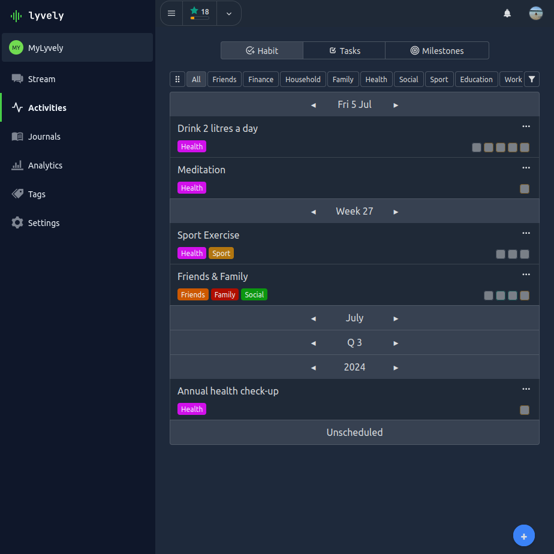

# Habits

With the Habits feature, you can keep track of recurring activities within a profile. 

A habit can be configured with the
following options:

- **Title**: The content title.
- **Description**: A detailed description of the habit.
- **Interval**: The interval of the habit e.g. Day, Week, Month (see below).
- **Min Value**: The minimum of units you plan to complete the habit within the interval.
- **Optimal Value**: The optimal amount of units you plan to complete the habit within the interval.
- **Max Value**: The max amount of units you plan to complete the habit within the interval.
- **Score**: Choose a score, which reflects the effort and priority of a habit.
- **User Strategy**: A habit can be configured as `per-user` or `shared` for personal or collaborative habit management.
- **Input Type**: The type of input used to keep track of our habit.
    - `Checkboxes`: A checkbox list limited to 1-8 checkboxes.
    - `Spinner`: Manual number input with spinner buttons.
    - `Range`: A range input slider.
    - `Timer`: A timer input with play/pause button and manual input capabilities.

Habits are managed within a calendar-plan view, which separates habits in one of the following intervals:

- `Daily`: A habit which I should be done once or multiple times a day.
    - I want drink at least 2 litre a day (split into 4 units).
    - I want to wake up at 8:00 AM each day.
- `Weekly`:  A habit which I should be done once or multiple times a week.
    - I want to do sports at least twice a week, but optimal three times and max 5 times.
- `Monthly`:  A habit which I should be done once or multiple times a month.
    - Once a month our team wants to do at least a team event.
- `Quarterly`:  A habit which I should be done once or multiple times a quarter.
    - Once a quarter our department should perform a goal assessment for long-term goals.
- `Yearly`:  A habit which I should be done once or multiple times a year.
    - I want to do a general health check once a year.
- `Unscheduled`: A habit which is not scheduled.
    - Our team wants to keep track about the amount of time spent on each project.
