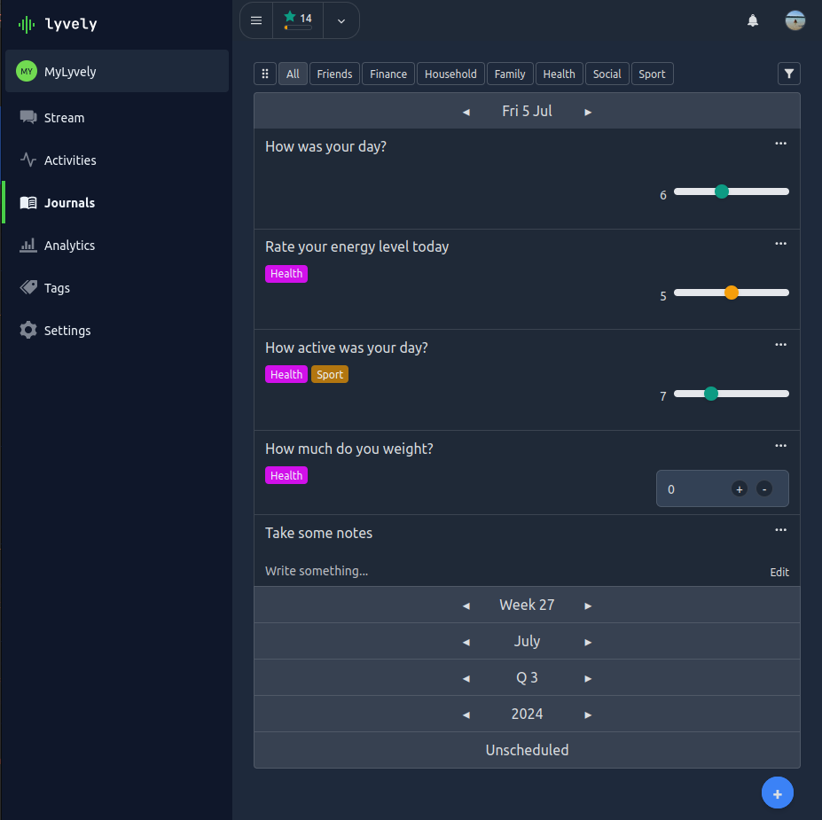

# Journals

While Tasks and Habits are used for tracking activities and todos within a profile, the Journals feature is meant to
track any kind of recurring data for reporting purposes in a calendar-plan view. 

Journals supports the following input types:

- **Numbers**: Similar to habits
- **Text**: Textarea input
- **Time**: A timer with play/pause button as well as manual input.
- **Multi Select** A checkbox list selection of predefined values.
- **Radio Select** A radio input selection of predefined values.
- **Dropdown Select** A dropdown selection of predefined values.