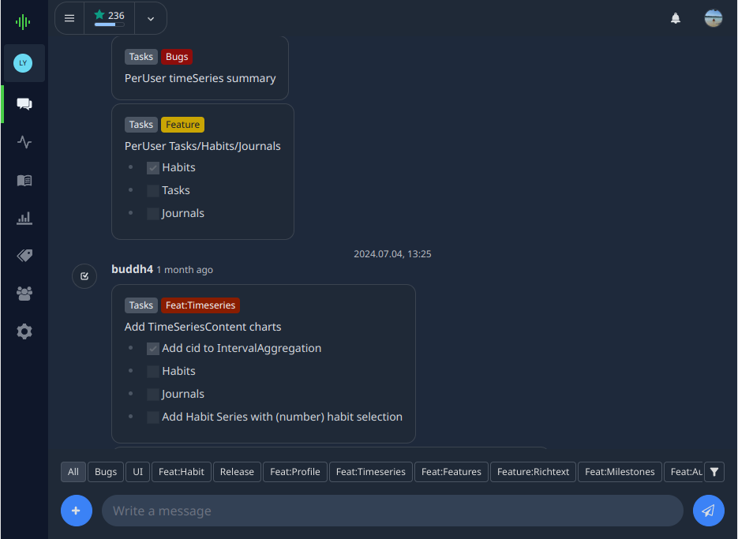
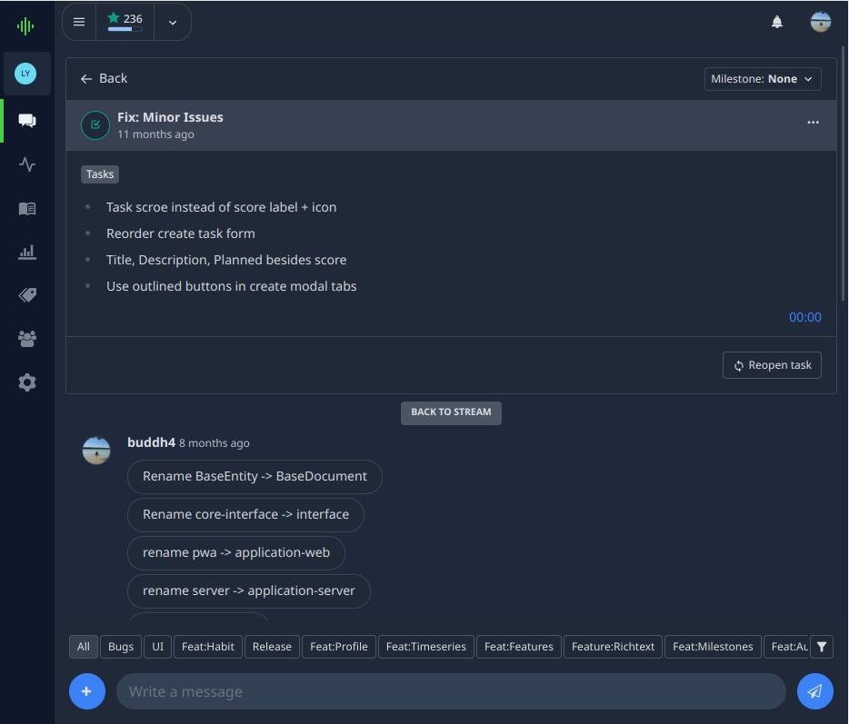

# Stream

The stream can be used to communicate with members or for brainstorming and information management. The profile stream will
contain various types of content in a chat-like view. Each content entry supports multi-level
sub-discussions consisting of streams themselves. This means you can not only create single-level, text-only comments
as with many other platforms, but rather add any kind of content to a discussion and sub-discussions.

:::tip
Most content types support the use of [Markdown](https://docs.github.com/en/get-started/writing-on-github/getting-started-with-writing-and-formatting-on-github/basic-writing-and-formatting-syntax)
for formating text including task lists.
:::

## Main Profile Stream

The profile stream displays all content created within a profile that is not part of a sub-discussion. It typically 
serves as the default view for a profile and can be accessed through both the profile navigation and the mobile footer.

In the profile stream, you can easily **create new content** by clicking the `+` button. To submit messages quickly, use the 
message input field and either press `Enter` or click the submit button on the right.

The **filter bar** allows you to quickly search for specific tags. For additional filtering options, click the filter button 
on the right side of the filter bar. When a filter is active, the filter icon will display a green indicator.

:::info
Users can create any type of content directly in the stream view.
:::

## Content Details Stream

When users click on a content entry, they are taken to a sub-discussion view that displays the content details along 
with a related sub-stream, which itself can contain any type of content. Each sub-discussion within the sub-stream 
can itself contain additional levels of sub-discussions. The Content Detail View may vary depending on the type of 
content being displayed.

The following image shows the detail view of a task entry:

