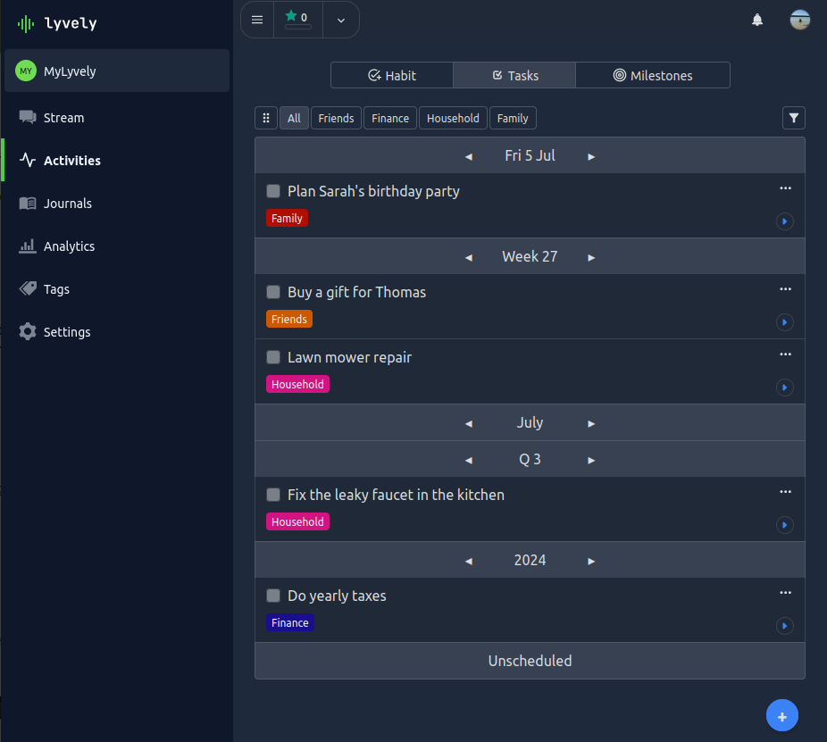

# Tasks

The Task feature can be used to manage tasks in a calendar-plan view. The calendar-plan view can be used
to sort tasks by priority. New tasks are may be added as `Unsceduled` similar to a backlog and can be moved up until 
the task is planned for today or within the next few days. 

A task supports the following options:

- **Title**: The content title.
- **Description**: A detailed description of the task.
- **Interval**: The interval the task is planned reflecting its priority e.g. within next few days, within this week (see below).
- **Score**: Choose a score, which reflects the cost of a task.
- **User Strategy**: A task can be configured as `per-user` or `shared` for personal or collaborative task management.

As mentioned, tasks are managed within a calendar-plan view, which separates tasks in one of the following intervals (suggestion):

- `Daily`: A task which should be completed within the next 1-2 days.
- `Weekly`:  A taks which should ideally be completed within this week.
- `Monthly`:  A Habit which I should be done once or multiple times a month.
- `Quarterly`:  A Habit which I should be done once or multiple times a quarter.
- `Yearly`:  A Habit which I should be done once or multiple times a year.
- `Unscheduled`: A Habit which is not scheduled.

:::note
The actual strategy of choosing an interval for your tasks is up to you and your team.
:::