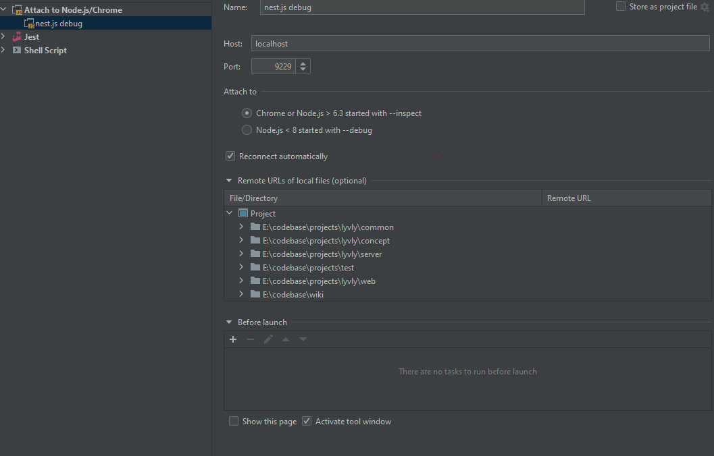

## Development environment

## Modules

### Create new module

```
nest generate module <name>
```

## Migration

### Install

```
npm install -g migrate-mongo
```

### Add migration

```
npm run migrate:create name-of-my-script
```

### Show status

```
npm run migrate:status
```

### Run migrations

```
npm run migrate:up
```

## Testing

### Run unit tests:

```
npn run test
```

### Run e2e tests:

1. Create and configure `.e2e.env` e.g:

```
MONGODB_URI=mongodb://localhost/lyvely-e2e
```

2. Start e2e env backend

```
npm run start:e2e
```

3. Open cypress

```
npx cypress open
```

## Check for circular dependencies

```
npx madge --circular --extensions ts ./
```

## Use depcruise to create dependency graph


### Install depcruise

```
npm i -g dependency-cruiser
npm i -g typescript
npm i -g vue-template-compiler
```

> Note: Typescript and vue compiler needs to be installed alongside dependency cruise

### Create dependency graph

```
depcruise --include-only "^src" --output-type dot src | dot -T svg > dependencygraph.svg
```

### Run depcruise checks

## Security

Set a `jwt-access-token-secret` in your environment. The secret must be at least 64 characters long.
You can generate a random secret with:

```
node -e "console.log(require('crypto').randomBytes(32).toString('hex'));"
```

## Debugging

```
npm run start:debug
```
**PhpStorm run config:**



### Installation

```shell
sudo adduser lyvely
sudo mkdir -p /var/www/lyvely
sudo chown lyvely: /var/www/lyvely
sudo -u myappuser -H bash -l
sudo git clone git@github.com:buddh4/lyvely-app.git code
npm install --no-save
npm common:build
npm server:build
npm web:build
```
